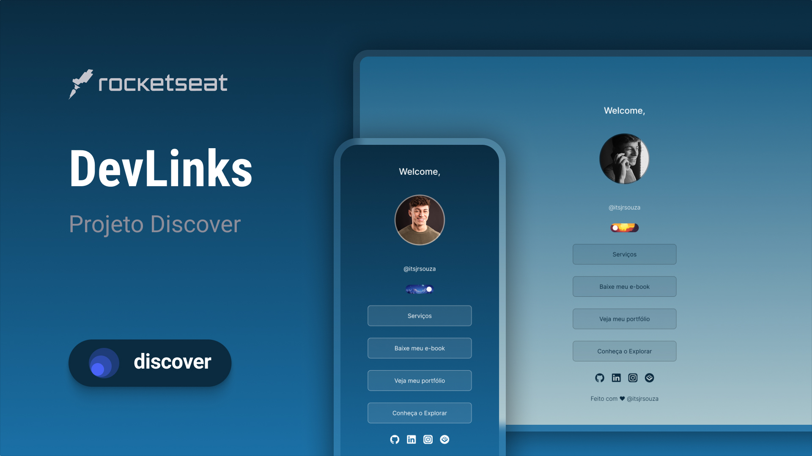

<h1 align="center">Linktree </h1>

Redesign do programa gratuito promovido pela Rocketseat. 
<a href="https://app.rocketseat.com.br/journey/discover/contents">
Estude esse projeto em formato de vídeo clicando aqui.</a>

  <a href="#-tecnologias">Tecnologias</a>&nbsp;&nbsp;&nbsp;|&nbsp;&nbsp;&nbsp;
  <a href="#-projeto">Projeto</a>&nbsp;&nbsp;&nbsp;|&nbsp;&nbsp;&nbsp;
  <a href="#-layout">Layout</a>&nbsp;&nbsp;&nbsp;|&nbsp;&nbsp;&nbsp;
  <a href="#memo-licença">Licença</a>

  

 

  

## 🚀 Tecnologias

Esse projeto foi desenvolvido com as seguintes tecnologias:

- HTML e CSS
- JavaScript
- Git e Github
- Figma

## 💻 Projeto

O Linktree é um agregador de links para usar como cartão de visitas online.

- [Acesse o projeto finalizado, online](https://github.com/itsjrsouza/linktree)

- [Assistir aulas](https://app.rocketseat.com.br/journey/discover/contents)

## 🔖 Layout

Você pode visualizar o layout do projeto por meio [DESSE LINK](https://www.figma.com/design/gA2XgYXcy6uVIUuRKgPhQa/Linktree?m=auto&t=dBZZXzauLNw7sCtx-1). É necessário ter conta no [Figma](https://figma.com) para acessá-lo.

## :memo: Licença

Esse projeto está sob a licença MIT.

---

Feito com ♥ by Rocketseat :wave: [Participe da nossa comunidade!](https://discord.gg/rocketseat)
